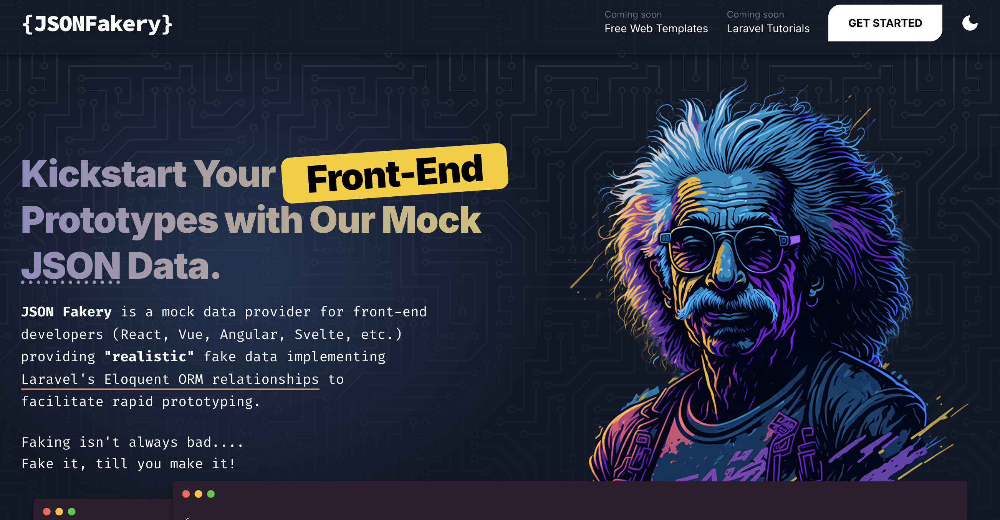
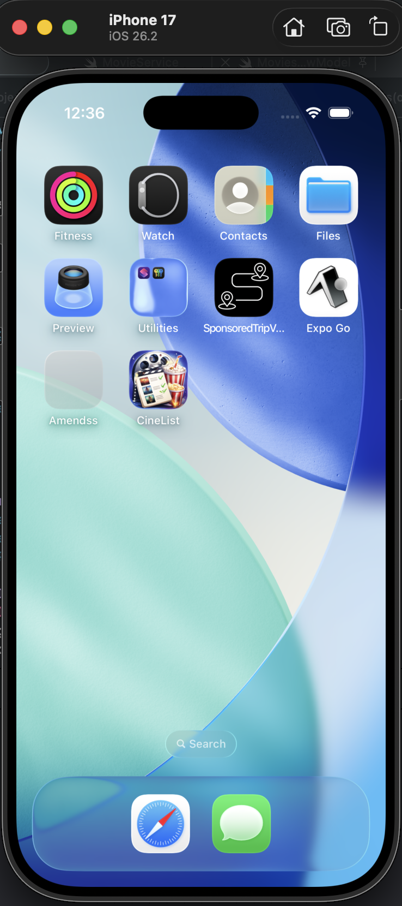
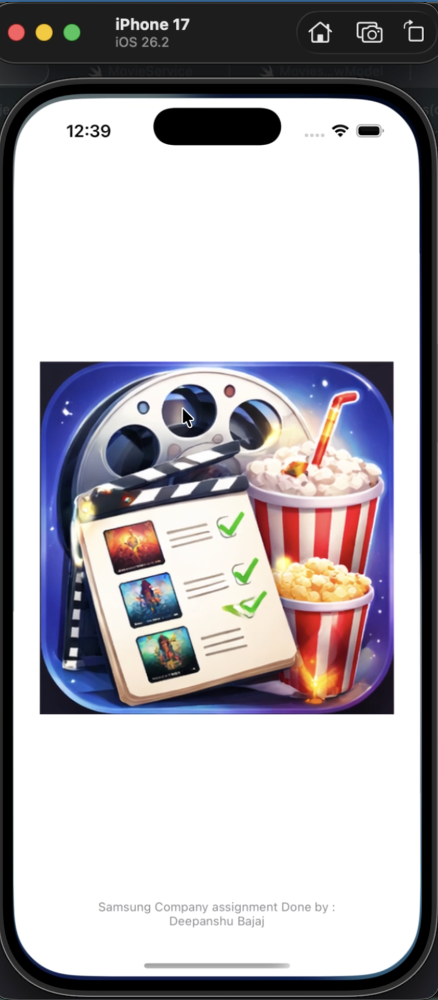
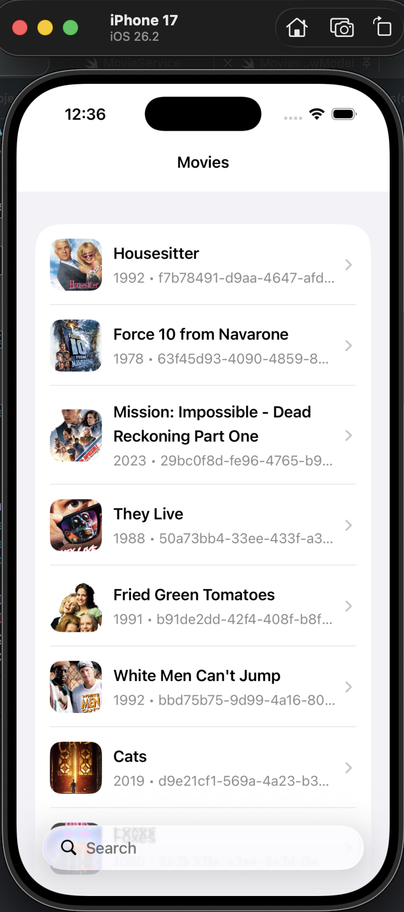
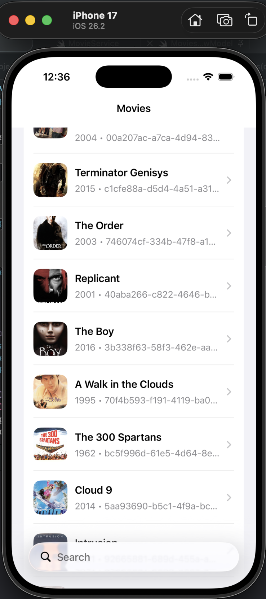
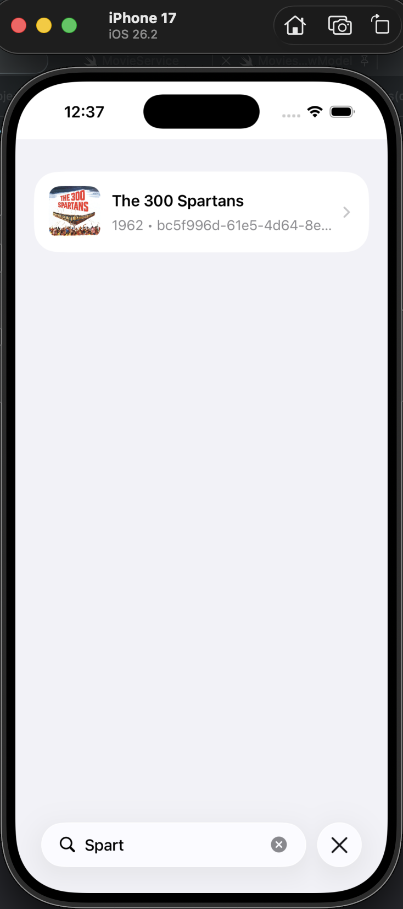
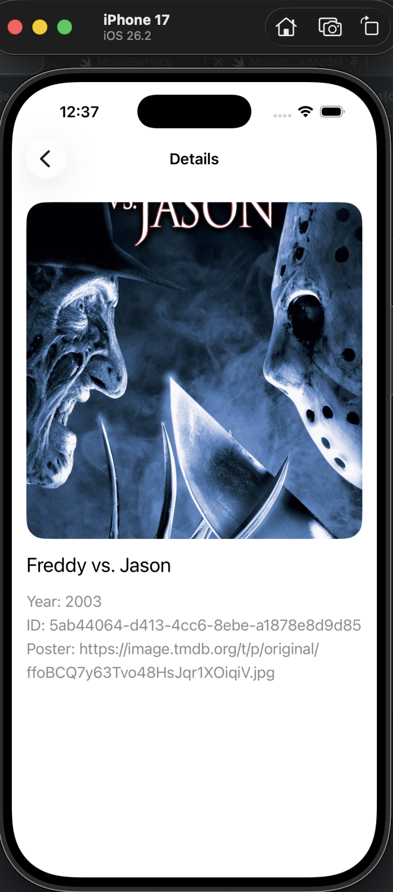
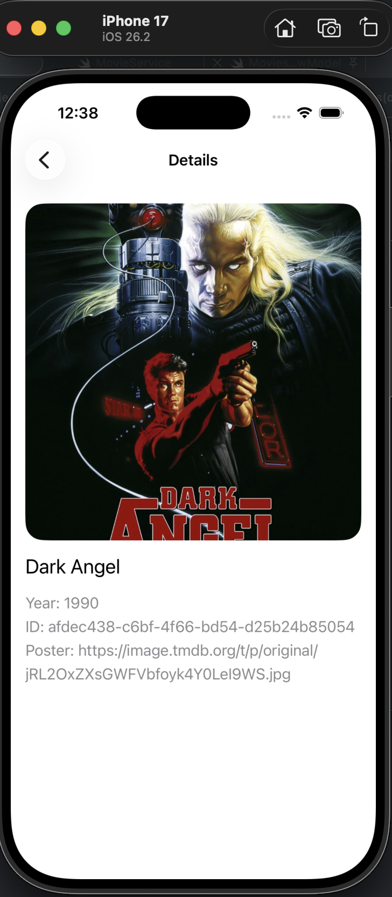
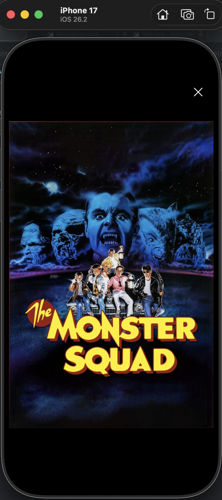

<h1 align="center">CineList - iOS App</h1>

<p align="center">
  ( Interview Assignment - Samsung Company )
</p>

<p align="center">
  
  
  
  
  
  
  
</p>

---

**CineList** is a lightweight iOS app built with **UIKit** that displays a list of movies using a paginated API.  
It demonstrates clean architecture, async networking with `URLSession`, and an interactive UI with image preview support.

---

## ✨ Features

- 🎬 **Movie Listing**: Displays movies with title, year, and poster
- 🔄 **Pagination**: Loads more data as you scroll
- 🔍 **Search Support**: Query-based movie fetching
- 🖼️ **Full Screen Preview**: Tap to view images with zoom & gestures
- ⚡ **Async Networking**: Uses `async/await` with URLSession
- 🧩 **Reusable Components**: Clean and modular UIKit code

---

## 📦 Requirements

- iOS **18.5+**
- Xcode **16.4+**
- Swift **5.0**

---

## ⛓ Project Structure

    CineList
    .
    ├── samsungProject                   # App target sources
    │   ├── AppDelegate.swift / SceneDelegate.swift
    │   ├── ViewController.swift (or feature view controllers)
    │   ├── ImageLoader.swift (utility for image loading)
    │   ├── Assets.xcassets
    │   └── Base.lproj            # Storyboards (Main.storyboard, LaunchScreen.storyboard)
    ├── samsungProjectTests            # Unit tests
    ├── samsungProjectUITests         # UI tests
    └── samsungProject.xcodeproj

---

## 🛠️ Installation

1. Clone the repository:
   ```bash
   git clone https://github.com/deepanshubajaj/CineList-Samsung-Work.git
   ```

2. Open in Xcode:
   ```bash
   open samsungProject.xcodeproj
   ```

3. Build and run on a simulator or device (Scheme: `samsungProject`).

---

## 🧪 Running Tests

From Xcode: Product → Test

From the command line:

```sh
xcodebuild test -project Hive.xcodeproj -scheme Hive -destination 'platform=iOS Simulator,name=iPhone 17'
```

If the destination name doesn’t exist on your machine, list available simulators and pick one:

```sh
xcrun simctl list devices
```

---

## 🌐 API

- Endpoint: `https://jsonfakery.com/movies/paginated?page={page}`
- Type: Mock paginated API
- No API key required

<p align="center">
  
</p>

---

## 🎨 App Look:

<p align="center">
  
</p>
<p align="center">
  *App snapshot in the simulator.*
</p>

---

## 🖼️ Screenshots:

<p align="center">
  
</p>

<p align="center">
  *Splash screen displayed upon app launch.*
</p>

##

<p align="center">
    
    
    
</p>

<p align="center">
    
    
    
</p>

<p align="center">
  *Screenshots of the Cine List App showing different screens*
</p>

---

## 📱 App Icon:

<p align="center">
  
</p>
<p align="center">
  *The App Icon reflects the Cine List Look*
</p>

---

## 🚀 Video Demo:

Here’s a short video showcasing the app's functionality:

<p align="center">
  
</p>

➤ <a href="ProjectOutputs/WorkingVideo/WorkingVideoD.MP4">🎥 Watch Working Video</a>

---

## 🤝 Contributing

Contributions are welcome.

1. Fork the repository
2. Create a feature branch:
   ```bash
   git checkout -b feature/your-feature-name
   ```
3. Commit your changes:
   ```bash
   git commit -m "Add your feature"
   ```
4. Push and open a pull request

---

## 📃 License:

This project is licensed under the [Apache-2.0 License](./LICENSE).  
You are free to use this project for personal, educational, or commercial purposes — just make sure to provide proper attribution.

> **Clarification:** Commercial use includes, but is not limited to, use in products,  
> services, or activities intended to generate revenue, directly or indirectly.


